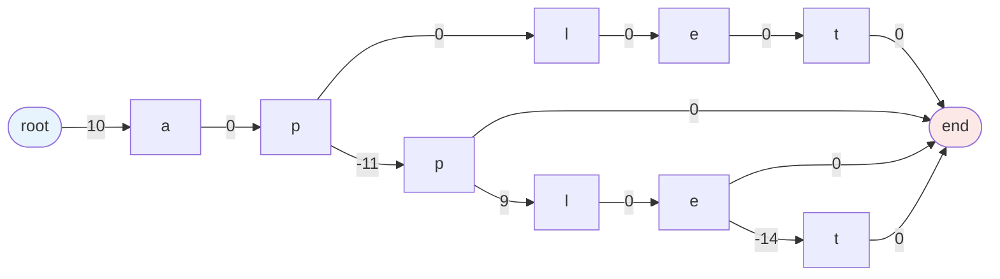
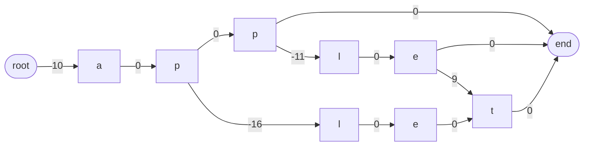

[中文](#中文) | [English](#english)

# JFST

## 中文

Finite State Transducer 的 Java 实现

### FST 简介

FST（Finite state transducer）是一种用于字符串匹配的数据结构，并且在字符串匹配的同时产生一个输出。它的作用类似于一个 Map，并且支持倒序搜索和通配符搜索。FST 相较于 Map 而言使用的内存大大减少，因为这种数据结构在存储字符串的过程中支持前缀和后缀的共享。

如果想要了解更多的理论和实现细节，请参考这篇博客 https://burntsushi.net/transducers/

### 使用案例

```
public static String[] str2Array(String str){
        int len = str.length();
        String[] ret = new String[len];
        for (int i = 0; i < len; i++) {
            ret[i] =  String.valueOf(str.charAt(i));
        }
        return ret;
    }

public static void main(String[] args) {
    String[] examples = new String[]{"app", "apple", "applet", "aplet"};
    long[] outputs = new long[]{10, -1, 8, -6};
    // 短语在加入 FST 前必须排序
    Arrays.sort(examples);
    ArrayList<fstPair<Long, String[]>> inputs = new ArrayList<>();
    for (int i = 0; i < examples.length; i++){
        // 在 FST 中一个节点不一定非要是一个字符
        String[] phrase = str2Array(examples[i]);
        fstPair<Long, String[]> entry = new fstPair<>(outputs[i], phrase);
        inputs.add(entry);
    }

    FST fst = new FST();
    fst.build(inputs);
    String[] example1 = str2Array("app");
    String[] example2 = str2Array("et");
    System.out.println(fst.fuzzySearchPrefix(example1));
    System.out.println(fst.fuzzySearchSuffix(example2));
    System.out.println(fst.search(example1));
    System.out.println(fst.backSearch(example2));
    System.out.println(fst.backSearch(example1));
}

// 打印结果
[-1=[a, p, p], 8=[a, p, p, l, e], -6=[a, p, p, l, e, t]]
[-6=[a, p, p, l, e, t], 10=[a, p, l, e, t]]
-1=[a, p, p]
0=[]
-1=[a, p, p]
```

#### 案例内存结构



### 环境配置

* jdk 1.8+
* maven 3.8.1+

### 许可证协议

Apache-2.0

---

## English

A Java implementation of Finite State Transducer

### Introduction to FST

FST (Finite state transducer) is a data structure that facilitates string match and produces an output. It functions as a Map and allows reverse and wild card search, and uses much less memory to store entries than a common Map because of the sharing of prefix and suffix.

For theoretical and implementation details, please refer to this blog https://burntsushi.net/transducers/

### Usage example

```
public static String[] str2Array(String str){
        int len = str.length();
        String[] ret = new String[len];
        for (int i = 0; i < len; i++) {
            ret[i] =  String.valueOf(str.charAt(i));
        }
        return ret;
    }

public static void main(String[] args) {
    String[] examples = new String[]{"app", "apple", "applet", "aplet"};
    long[] outputs = new long[]{10, -1, 8, -6};
    // phrases must be sorted before adding into FST
    Arrays.sort(examples);
    ArrayList<fstPair<Long, String[]>> inputs = new ArrayList<>();
    for (int i = 0; i < examples.length; i++){
        // the reason why an entry must be a string list is a node in FST does not have to be a character
        String[] phrase = str2Array(examples[i]);
        fstPair<Long, String[]> entry = new fstPair<>(outputs[i], phrase);
        inputs.add(entry);
    }

    FST fst = new FST();
    fst.build(inputs);
    String[] example1 = str2Array("app");
    String[] example2 = str2Array("et");
    System.out.println(fst.fuzzySearchPrefix(example1));
    System.out.println(fst.fuzzySearchSuffix(example2));
    System.out.println(fst.search(example1));
    System.out.println(fst.backSearch(example2));
    System.out.println(fst.backSearch(example1));
}

// print result
[-1=[a, p, p], 8=[a, p, p, l, e], -6=[a, p, p, l, e, t]]
[-6=[a, p, p, l, e, t], 10=[a, p, l, e, t]]
-1=[a, p, p]
0=[]
-1=[a, p, p]
```

#### Example memory layout



### Environment configuration

* jdk 1.8+
* maven 3.8.1+

### License

Apache-2.0
